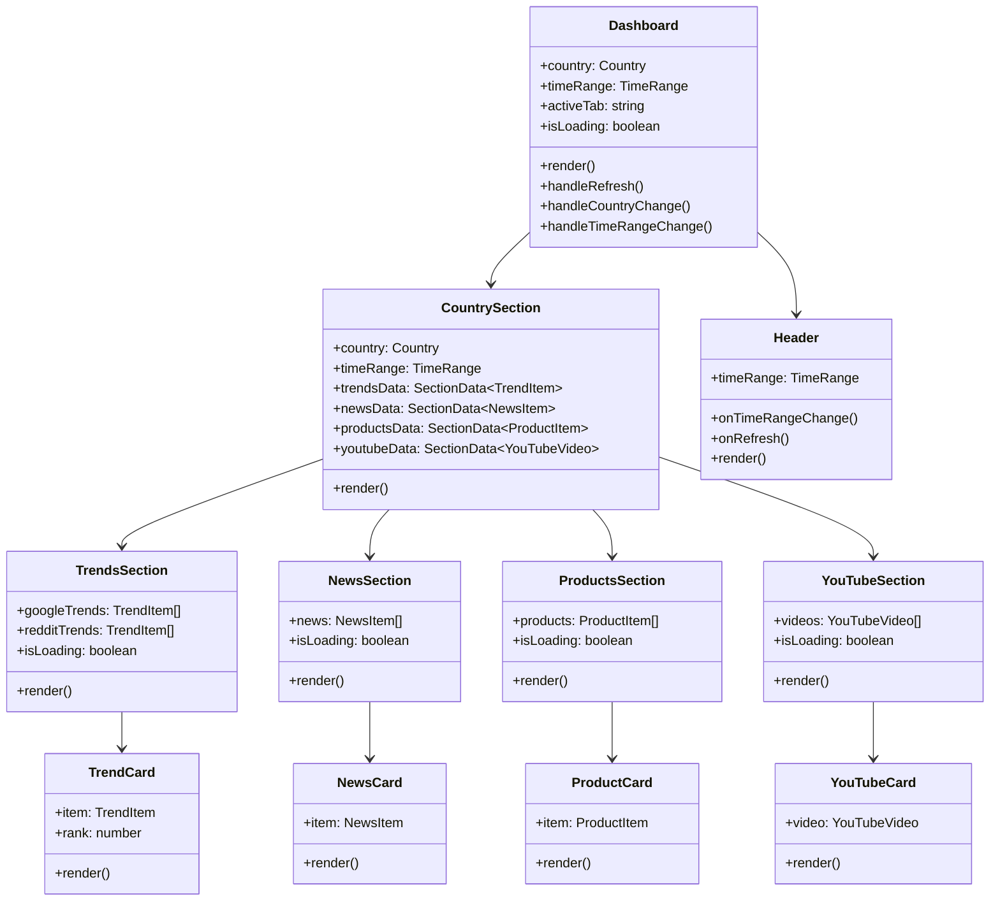

# ET Aggregator — System Architecture

> **Document purpose:** Visual and textual description of the system architecture using UML and ASCII diagrams.

---

## 1. High-Level System Architecture

```
┌─────────────────────────────────────────────────────────────────────────────────┐
│                              USER'S BROWSER                                     │
│                                                                                 │
│  ┌────────────────────────────────────────────────────────────────────────────┐ │
│  │                     ET AGGREGATOR DASHBOARD (React)                        │ │
│  │                                                                            │ │
│  │  ┌──────────────────┐    ┌──────────────────┐    ┌──────────────────────┐ │ │
│  │  │    UK Section     │    │    US Section     │    │  Time Range Toggle   │ │ │
│  │  │                  │    │                  │    │  [Today] [7 Days]    │ │ │
│  │  │  • Google Trends │    │  • Google Trends │    └──────────────────────┘ │ │
│  │  │  • Reddit Posts  │    │  • Reddit Posts  │                             │ │
│  │  │  • News Stories  │    │  • News Stories  │                             │ │
│  │  │  • YouTube       │    │  • YouTube       │                             │ │
│  │  │  • Products      │    │  • Products      │                             │ │
│  │  └─────────┬────────┘    └─────────┬────────┘                             │ │
│  └────────────┼─────────────────────────────────────────────────────────────┘ │
│               │  fetch() calls (parallel)                                       │
└───────────────┼─────────────────────────────────────────────────────────────────┘
                │
                ▼ HTTP/HTTPS
┌─────────────────────────────────────────────────────────────────────────────────┐
│                         NEXT.JS SERVER (Node.js)                                │
│                                                                                 │
│  ┌────────────────────┐  ┌────────────────────┐  ┌──────────────────────────┐  │
│  │  GET /api/trends   │  │  GET /api/news     │  │  GET /api/youtube        │  │
│  │  ?country=uk|us    │  │  ?country=uk|us    │  │  ?country=uk|us          │  │
│  │  &timeRange=...    │  │  &timeRange=...    │  │  &timeRange=...          │  │
│  └────────┬───────────┘  └────────┬───────────┘  └────────────┬─────────────┘  │
│           │                       │                            │                │
│  ┌────────────────────┐           │              ┌────────────────────────────┐ │
│  │  GET /api/products │           │              │  Promise.allSettled()       │ │
│  │  ?country=uk|us    │           │              │  (each route fetches from  │ │
│  │  &timeRange=...    │           │              │   multiple sources)         │ │
│  └────────────────────┘           │              └────────────────────────────┘ │
│                                   │                                             │
│  ┌────────────────────────────────────────────────────────────────────────────┐ │
│  │                        API CLIENT MODULES                                  │ │
│  │                                                                            │ │
│  │  lib/api/google-trends.ts  │  lib/api/reddit.ts  │  lib/api/news.ts       │ │
│  │  lib/api/youtube.ts        │  lib/api/twitter.ts │  lib/api/products.ts   │ │
│  └────────────────────────────────────────────────────────────────────────────┘ │
│                                                                                 │
│  [ Environment Variables: NEWS_API_KEY, YOUTUBE_API_KEY, TWITTER_BEARER_TOKEN ] │
└─────────────────────────────────────────────────────────────────────────────────┘
                │               │               │              │
                ▼               ▼               ▼              ▼
        ┌───────────┐  ┌──────────────┐  ┌──────────┐  ┌────────────────┐
        │  Google   │  │  Reddit JSON │  │ NewsAPI  │  │  YouTube API   │
        │  Trends   │  │  Public API  │  │  (Free)  │  │  Data API v3   │
        │  (scrape) │  │  (No auth)   │  │          │  │                │
        └───────────┘  └──────────────┘  └──────────┘  └────────────────┘
                         ┌──────────────┐  ┌──────────────────────────┐
                         │  Twitter/X   │  │  Glimpse API             │
                         │  API v2      │  │  (Paid B2B)              │
                         │  (Optional)  │  │  (Optional)              │
                         └──────────────┘  └──────────────────────────┘
```

---

## 2. Component Architecture (UML Class Diagram - Mermaid)



---

## 3. Data Flow Diagram

```
                    USER ACTION
                   (page load / refresh / filter change)
                          │
                          ▼
              ┌─────────────────────┐
              │   Dashboard.tsx     │
              │   (Client Component)│
              │                     │
              │  useEffect(() => {  │
              │    fetchAllData()   │
              │  }, [country, time])│
              └──────────┬──────────┘
                         │
          ┌──────────────┼──────────────┐
          │              │              │              (all in parallel)
          ▼              ▼              ▼
   /api/trends     /api/news     /api/youtube     /api/products
          │              │              │              │
          │   Promise.allSettled() within each route  │
          │              │              │              │
     ┌────┴────┐   ┌─────┴─────┐  ┌───┴────┐  ┌─────┴──────┐
     │ Google  │   │  NewsAPI  │  │YouTube │  │  Reddit    │
     │ Trends  │   │           │  │API v3  │  │  Deals     │
     ├─────────┤   └───────────┘  └────────┘  └────────────┘
     │ Reddit  │
     │ Posts   │
     └─────────┘
          │              │              │              │
          ▼              ▼              ▼              ▼
      JSON resp      JSON resp      JSON resp      JSON resp
          │              │              │              │
          └──────────────┴──────────────┴──────────────┘
                                │
                   Promise.all([fetch1, fetch2, ...])
                                │
                                ▼
                    State update → Re-render
                    (setTrendsData, setNewsData, etc.)
                                │
                                ▼
                       DASHBOARD DISPLAYS DATA
```

---

## 4. API Route Sequence Diagram

```
Browser           Next.js Route Handler        External APIs
   │                      │                         │
   │──GET /api/trends────>│                         │
   │  ?country=uk         │                         │
   │  &timeRange=today    │                         │
   │                      │──Google Trends──────────>│
   │                      │──Reddit UK Top──────────>│
   │                      │   (parallel)             │
   │                      │<──Google response────────│
   │                      │<──Reddit response────────│
   │                      │                         │
   │                      │ normalise + merge data   │
   │                      │                         │
   │<──JSON response──────│                         │
   │  { google: [...],    │                         │
   │    reddit: [...],    │                         │
   │    fetchedAt: "..." }│                         │
```

---

## 5. Folder Structure

```
et-aggregator/
│
├── app/                          # Next.js App Router
│   ├── layout.tsx                # Root HTML layout, fonts, metadata
│   ├── page.tsx                  # Main dashboard (client component)
│   ├── globals.css               # Global styles, CSS variables
│   ├── providers.tsx             # Client-side provider wrapper
│   └── api/                      # Server-side API Route Handlers
│       ├── trends/route.ts       # Google Trends + Reddit aggregation
│       ├── news/route.ts         # NewsAPI headlines
│       ├── youtube/route.ts      # YouTube trending videos
│       └── products/route.ts     # Reddit deal subreddits (products)
│
├── components/                   # Reusable React components
│   ├── Header.tsx                # App header with controls
│   ├── Dashboard.tsx             # Main dashboard layout
│   ├── CountrySection.tsx        # Per-country data section
│   ├── TrendsSection.tsx         # Google + Reddit trends
│   ├── NewsSection.tsx           # News headlines section
│   ├── ProductsSection.tsx       # Trending products section
│   ├── YouTubeSection.tsx        # YouTube trending section
│   ├── TrendCard.tsx             # Individual trend item card
│   ├── NewsCard.tsx              # Individual news card
│   ├── ProductCard.tsx           # Individual product card
│   ├── YouTubeCard.tsx           # Individual YouTube card
│   ├── TrendsChart.tsx           # Recharts line chart
│   ├── SectionHeader.tsx         # Section header with icon
│   ├── LoadingSkeleton.tsx       # Skeleton loading placeholders
│   ├── Badge.tsx                 # Coloured badge component
│   └── ErrorMessage.tsx          # Error display component
│
├── lib/                          # Shared utilities and API clients
│   ├── types.ts                  # TypeScript type definitions
│   ├── utils.ts                  # Helper functions (cn(), formatters)
│   ├── mock-data.ts              # Demo data for missing API keys
│   └── api/                      # API integration modules
│       ├── google-trends.ts      # Google Trends API client
│       ├── reddit.ts             # Reddit API client
│       ├── news.ts               # NewsAPI client
│       └── youtube.ts            # YouTube API client
│
├── research/                     # Documentation (you are here)
│   ├── research.md               # Technology choices & rationale
│   ├── architecture.md           # This file
│   ├── api-sources.md            # API documentation
│   └── design-system.md          # UI/UX design decisions
│
├── public/                       # Static assets
├── .env.local.example            # Environment variable template
├── .eslintrc.json                # ESLint configuration
├── next.config.ts                # Next.js configuration
├── postcss.config.mjs            # PostCSS/Tailwind build config
├── tailwind.config.ts            # Tailwind customisation
├── tsconfig.json                 # TypeScript configuration
└── package.json                  # Dependencies and scripts
```

---

## 6. State Management Architecture

No external state management library (Redux, Zustand, Jotai) is needed. The dashboard uses:

```
┌─────────────────────────────────────────┐
│              page.tsx                   │
│         (Root Client Component)         │
│                                         │
│  State:                                 │
│  ├── country: 'UK' | 'US'               │
│  ├── timeRange: 'today' | '7days'       │
│  ├── activeTab: string                  │
│  ├── isLoading: boolean                 │
│  ├── lastUpdated: Date                  │
│  └── Per-section data + loading states  │
│                                         │
│  Props flow down to:                    │
│  └── CountrySection                     │
│      ├── TrendsSection → TrendCards     │
│      ├── NewsSection   → NewsCards      │
│      ├── ProductsSection → ProductCards │
│      └── YouTubeSection  → YTCards      │
└─────────────────────────────────────────┘
```

**Why no Redux/Zustand?**
The dashboard has simple, linear state: fetch data → display data → allow filter changes → refetch. There are no cross-component state mutations, no complex derived state, and no time-travel debugging needs. `useState` + `useEffect` is the right tool.

---

## 7. Error Handling Strategy

```
                    API Call
                       │
              ┌────────┴────────┐
              │                 │
           Success            Failure
              │                 │
        Return data      Log error server-side
              │                 │
              │         Return error metadata
              │         { error: "...", isDemo: true }
              │                 │
              └────────┬────────┘
                       │
                Dashboard receives response
                       │
              ┌────────┴────────┐
              │                 │
          has data           has error
              │                 │
          Display          Display error badge
          normally         + demo data clearly
                           labelled as "DEMO"
```

This ensures the dashboard is always **usable** even when:
- An API key is missing or invalid
- An external API is rate-limited or down
- Network issues prevent some requests from completing

---

*Document generated: 2026-02-20*
*Project: ET Aggregator v0.1.0*
